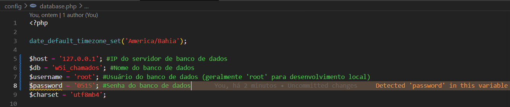
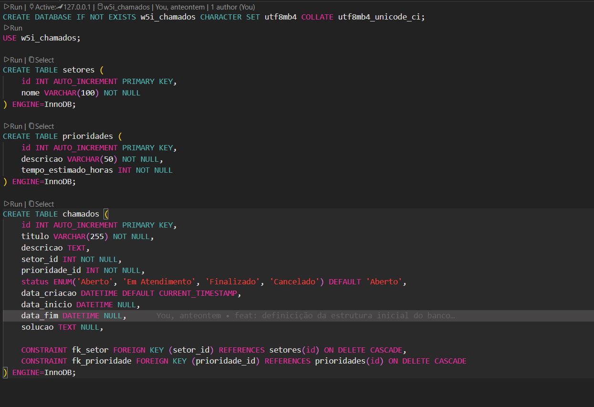
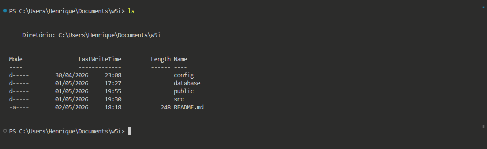
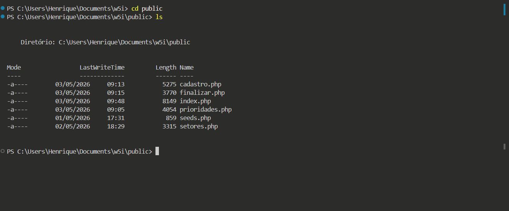
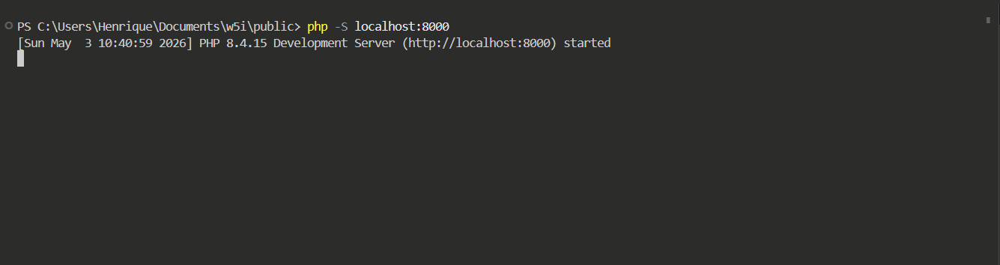
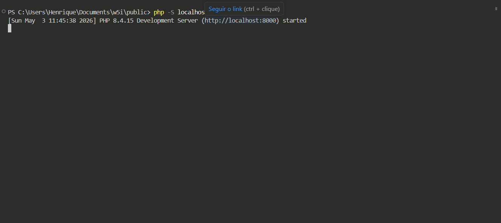
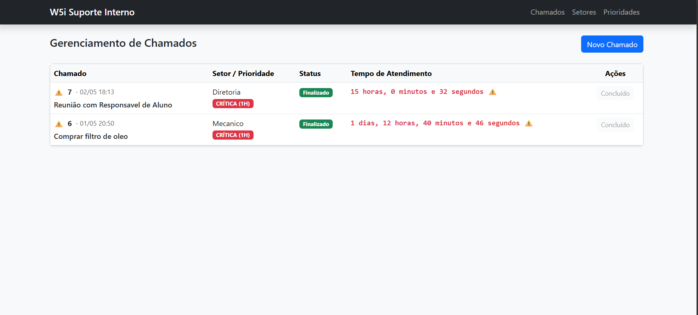

## 1. Configurando o Banco de Dados

Abra o arquivo `config/database.php` e preencha as credenciais de conexão nas linhas 5 a 8:



Em seguida, acesse a pasta `database/` e abra o arquivo `schema.sql`. Execute cada bloco de código clicando em **RUN** sequencialmente, do início ao fim do arquivo.



---

## 2. Clonando o Repositório

Após o `git clone`, seu terminal estará posicionado na raiz do projeto:

```bash
git clone https://github.com/itamarHenrique/w5i-case-tecnico.git
```



---

## 3. Acessando o Diretório `/public`

O projeto deve ser iniciado a partir do diretório `/public`. Navegue até ele com:

```bash
cd public
```



---

## 4. Iniciando o Servidor Local

Dentro de `/public`, inicie o servidor embutido do PHP:

```bash
php -S localhost:8000
```



> **Nota:** A porta `8000` é apenas um exemplo — qualquer porta disponível pode ser usada.

---

## 5. Abrindo no Navegador

Com o servidor em execução, dê um duplo clique no link exibido entre parênteses no terminal:



O projeto abrirá automaticamente no navegador:



> As abas **Setor** e **Prioridade** estão disponíveis no canto superior direito da página.